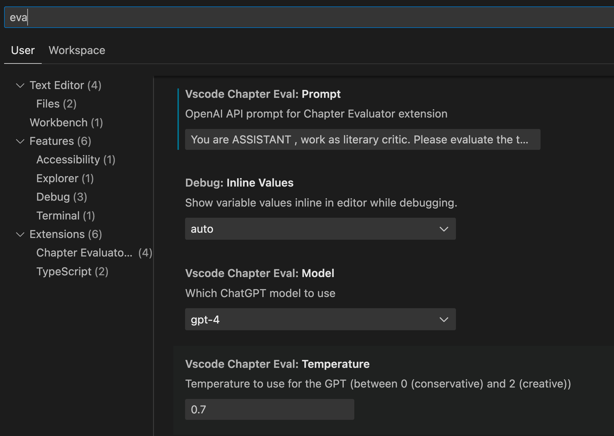

# AI エディター

[English](./README.md) | [Chinese (Simplified - zh-cn): 中文（简体）](./README.zh-cn.md) | [Chinese (Traditional - zh-tw): 中文（繁體）](./README.zh-tw.md) | [Cantonese (Traditional - zh-hk): 中文（繁體.粤语）](./README.zh-hk.md)｜[Japanese (ja): 日本語](./README.ja.md) | [French (fr): Français](./README.fr.md) | [German (de): Deutsch](./README.de.md) | [Italian (it): Italiano](./README.it.md) | [Spanish (es): Español](./README.es.md) | [Portuguese (Brazilian - pt-br): Português (Brasil)](./README.pt-br.md) | [Russian (ru): Русский](./README.ru.md) | [Korean (ko): 한국어](./README.ko.md)

**AI エディター**は、Visual Studio Code拡張機能で、AIの力を利用して小説の章を評価するのに役立ちます。このツールは、野心的な作家や経験豊富な作家が自分の作品に対する洞察を得て、書き込みのスキルを向上させるために設計されています。

### この拡張機能の目的

この拡張機能は、多くの人が小説を書く夢を実現するためです。最近この旅を始めたプログラマーとして、このツールを開発して、自分の章の評価プロセスを簡素化し、異なるツール間を面倒くさく切り替えることなく、物語る能力を向上させました。

### 主な特徴

- **Markdown とプレーンテキストファイルのサポート**：Markdown とプレーンテキスト形式で書かれた章をシームレスに評価します。
- **AI 統合**：AI を利用して、物語の緊張感と書き込みの品質を分析します。
- **ローカルモデルのサポート**：0.7.x バージョンから、この拡張機能はローカルモデル（ollama）による評価をサポートし始めましたが、結果は異なる場合があります。
- **ユーザーフレンドリーなインターフェース**：簡単にアクセスできるコマンドで、評価、フォーマット、テキスト管理が簡単です。
- **テキスト読み上げのサポート**：この拡張機能では、選択したテキストを読み上げることもできます。

### なぜそれを使用すべきか

すべての作家は自分の作品に自信を持ちべきです。AI エディターを通じて、物語の关键的な分野（リズム、緊張感、キャラクター開発など）に対する建設的なフィードバックを得ることができます。この拡張機能は、スコアを得るためだけではなく、あなたの書き込みをより深く理解するためです。

### OpenAI API キーを取得する方法

この拡張機能を使用するには、OpenAI から API キーが必要です。以下の手順に従って取得してください：

1. [OpenAI のウェブサイト](https://platform.openai.com/account/api-keys)にアクセスし、アカウントをお持ちでない場合は作成してください。
2. 「新しいキーを作成」ボタンをクリックします。
3. キーをコピーして拡張機能設定の「API キー」フィールドに貼り付けます。

### 拡張機能の設定

VS Code 環境でこの拡張機能の設定を更新し、機能を必要に応じて調整します。

推奨されるプロンプトは次のとおりです：
