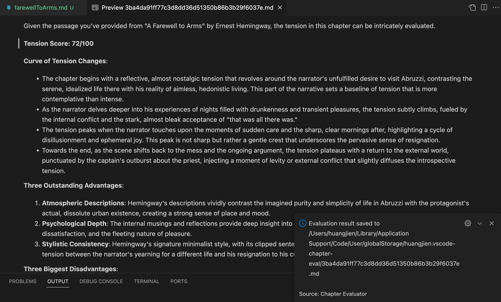

# Editor AI

[English](./README.md) | [Chinese (Simplified - zh-cn): 中文（简体）](./README.zh-cn.md) | [Chinese (Traditional - zh-tw): 中文（繁體）](./README.zh-tw.md) | [Cantonese (Traditional - zh-hk): 中文（繁體.粤语）](./README.zh-hk.md)｜[Japanese (ja): 日本語](./README.ja.md) | [French (fr): Français](./README.fr.md) | [German (de): Deutsch](./README.de.md) | [Italian (it): Italiano](./README.it.md) | [Spanish (es): Español](./README.es.md) | [Portuguese (Brazilian - pt-br): Português (Brasil)](./README.pt-br.md) | [Russian (ru): Русский](./README.ru.md) | [Korean (ko): 한국어](./README.ko.md)

**Editor AI** é uma extensão do Visual Studio Code que utiliza a capacidade da AI para ajudar os autores a avaliar seus capítulos de romance. Essa ferramenta foi projetada para ajudar escritores ambiciosos e experientes a obter insights sobre sua escrita e aprimorar suas habilidades de escrita.

### O objetivo dessa extensão

Essa extensão visa realizar o sonho de muitos de escrever um romance. Como um programador que recentemente começou neste caminho, desenvolvi essa ferramenta para simplificar o processo de avaliação de meus capítulos, ajudando-me a melhorar minha capacidade de narrativa sem precisar alternar entre diferentes ferramentas.

### Principais recursos

- **Suporte a arquivos Markdown e texto simples**: Avaliação contínua dos capítulos escritos em formatos Markdown e texto simples.
- **Integração com AI**: Utiliza o AI da OpenAI para analisar a tensão narrativa e a qualidade da escrita.
- **Suporte a modelos locais**: A partir da versão 0.7.x, essa extensão começou a oferecer suporte à avaliação com modelos locais (ollama), embora os resultados possam variar.
- **Interface amigável para o usuário**: Comandos facilmente acessíveis permitem uma avaliação, formatação e gerenciamento de texto simples.
- **Suporte à conversão de texto em fala**: Essa extensão também permite que você faça a leitura do texto selecionado em voz alta.

### Por que você deve usá-la

Todo escritor deve ter confiança em sua obra. Com o Editor AI, você pode obter feedback construtivo sobre áreas-chave da sua história, como ritmo, tensão e desenvolvimento de personagens. Esta extensão não é apenas para obter pontuações; é para entender melhor sua escrita.

### Como obter sua chave de API do OpenAI

Para usar esta extensão, você precisa obter uma chave de API do OpenAI. Siga estas etapas para obtê-la:

1. Acesse [o site da OpenAI](https://platform.openai.com/account/api-keys), se você não tiver uma conta, crie uma.
2. Clique no botão "Criar nova chave".
3. Copie a chave e cole no campo "Chave da API" nas configurações da extensão.

### Configurando a extensão

No seu ambiente do VS Code, atualize as configurações desta extensão para ajustá-la às suas necessidades.

O prompt sugerido é:

Por favor, leia o seguinte capítulo do romance e avalie-o de acordo com os seguintes critérios, com uma pontuação de 1 a 10 (1 é o mais baixo e 10 é o mais alto). Forneça uma explicação detalhada para cada pontuação, com base em sua avaliação, e cite exemplos específicos de trechos ou parágrafos para apoiar sua pontuação: Grau de atração da trama (1-10 pontos): O enredo deste capítulo é cativante? Existe algum motivo para que você queira continuar lendo? A pontuação é baseada em se a trama é compacta, interessante ou cheia de suspense. Pontuação: \_**\_ Razão e exemplo: Desenvolvimento de personagens (1-10 pontos): Os personagens são impressionantes? Seus atos e diálogos têm profundidade e autenticidade? A pontuação é baseada em se os personagens são únicos e se conseguem estabelecer uma conexão emocional com o leitor. Pontuação: \_\_** Razão e exemplo: Linguagem e estilo de escrita (1-10 pontos): A escrita do autor é clara e expressiva, e o texto flui bem? A pontuação é baseada na beleza da linguagem, na coerência da narrativa e na capacidade de transmitir efeitos emocionais e atmosfera de forma eficaz. Pontuação: \_**\_ Razão e exemplo: Grau de envolvimento emocional (1-10 pontos): Você teve alguma reação emocional ao ler (como tensão, curiosidade, entusiasmo, etc.)? A pontuação é baseada em se o texto pode desencadear uma forte resonância emocional. Pontuação: \_\_** Razão e exemplo: Suspense e expectativa (1-10 pontos): Este capítulo criou suspense ou deixou questões não respondidas, despertando seu desejo de continuar lendo? A pontuação é baseada em se o final do capítulo é suficientemente capturador. Pontuação: \_**\_ Razão e exemplo: Atração global (1-10 pontos): No geral, este capítulo te fez querer continuar lendo? A pontuação é baseada no desempenho geral do capítulo e em sua atração como início de um romance. Pontuação: \_\_** Razão e exemplo: Por favor, forneça a pontuação para cada seção e explique o motivo da sua pontuação, citando trechos específicos para apoiar seu julgamento. Vamos resolver esse problema lentamente e passo a passo para garantir que obtemos o resultado de análise correto.
$PROMPT$

**Nota:** `$PROMPT$` deve ser mantido inalterado, pois representa o conteúdo do capítulo atual.

### Como usar a extensão

No editor que contém o capítulo do romance:

1. Clique com o botão direito do mouse no texto.
2. Selecione "Avaliar Capítulo" no menu de contexto.

Espere um momento, e o AI retornará os resultados da avaliação, fornecendo insights valiosos para sua escrita:

### Sobre o modelo local

A partir da versão 0.7.x, o suporte a modelos locais está disponível, embora a eficácia possa variar com diferentes configurações e tipos de modelos.

### L10N

Esta ferramenta oferece suporte aos seguintes idiomas:

Chinês simplificado (zh-cn), chinês tradicional (zh-tw), japonês (ja), francês (fr), alemão (de), italiano (it), espanhol (es), português do Brasil (pt-br), russo (ru) e coreano (ko).

### Limitações e feedback

Como uma prova de conceito, esta extensão pode ter limitações ou erros. Seu feedback e contribuições são cruciais para melhorar seu desempenho. Se você gostou de usá-la, considere [me pagar um café ☕️](https://www.buymeacoffee.com/huangjien) para apoiar o desenvolvimento futuro.

    

 
