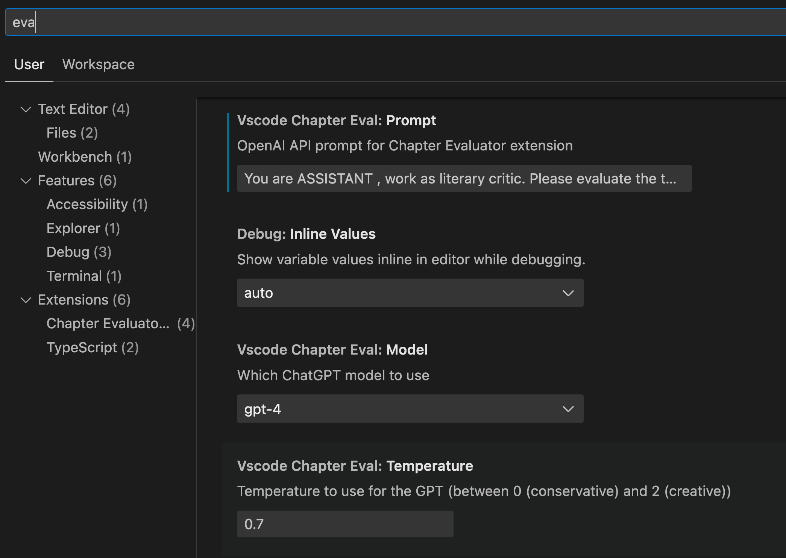
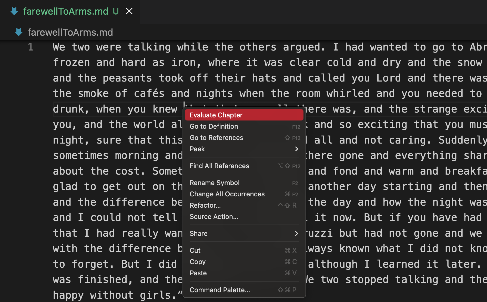
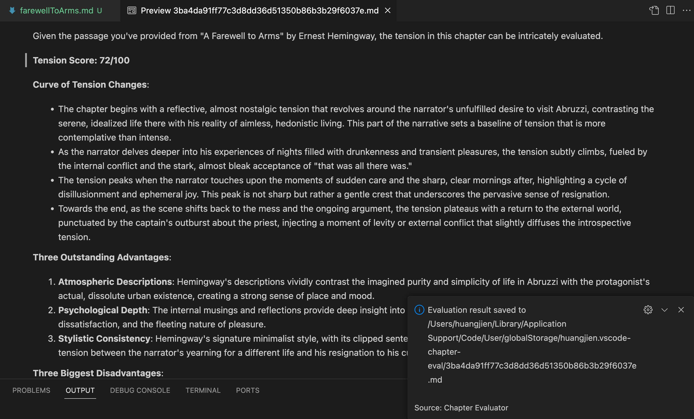

# AI редактор

**AI редактор** — это расширение Visual Studio Code, использующее возможности ИИ для помощи авторам в оценке глав их романов. Инструмент разработан для того, чтобы помочь амбициозным и опытным писателям получить.insights в своем письме и улучшить навыки письма.

### Цель этого расширения

Это расширение призвано сделать реальностью мечту многих о написании романа. Как программист, который недавно начал свой путь, я разработал этот инструмент, чтобы упростить процесс оценки моих глав и помочь улучшить мои нарратные способности, не переключаясь между различными инструментами.

### Основные возможности

- **Поддержка файлов Markdown и текстовых файлов**: Бесшовная оценка глав, написанных в формате Markdown и текстовых файлов.
- **Интеграция с ChatGPT**: Использование ChatGPT от OpenAI для анализа нарративной напряженности и качества письма.
- **Поддержка локальных моделей**: Начиная с версии 0.7.x, это расширение начинает поддерживать оценку с локальными моделями (ollama), хотя результаты могут отличаться.
- **Пользовательская дружественная интерфейс**: Простодоступные команды позволяют легко оценивать, форматировать и управлять текстом.

Поддержка текст-на-голос: Это расширение также позволяет вам произносить выбранный текст.
Почему вам следует использовать его
Каждый писатель должен быть уверен в своем произведении. С AI редактором вы можете получить конструктивную обратную связь по ключевым аспектам вашей истории, таким как ритм, напряжение и развитие персонажей. Это расширение не только для получения оценки; это для лучшего понимания вашего письма.

Получение вашей OpenAI API-ключа
Чтобы использовать это расширение, вам нужен API-ключ от OpenAI. Следуйте следующим шагам, чтобы получить его:

Посетите сайт OpenAI, если у вас еще нет учетной записи, пожалуйста, создайте ее.
Нажмите кнопку «Создать новый ключ».
Скопируйте ключ и вставьте его в поле «API-ключ» в настройках расширения.
Настройка расширения
В вашей среде VS Code обновите настройки этого расширения, чтобы настроить его функции в соответствии с вашими потребностями.

Рекомендуемый запрос:

Пожалуйста, прочитайте следующую главу романа и оцените ее согласно следующим критериям. Оценивайте каждую точку от 1 до 10 (1 - это наименьший балл, 10 - наивысший). Пожалуйста, подробно объясните причины вашей оценки, приводя конкретные примеры из текста:
Привлекательность сюжета (1-10 баллов): Является ли сюжет этой главы увлекательным? Есть ли у вас мотивация для продолжения чтения? Оцените на основе того, является ли сюжет сжатым, интересным или напряженным.  Оценка: ____ Причина и примеры:
Развитие персонажей (1-10 баллов): Замечательны ли персонажи? Имеют ли их действия и диалоги глубину и достоверность? Оцените на основе того, уникальны ли персонажи и способны ли они установить эмоциональную связь с читателем.  Оценка: ____ Причина и примеры:
Язык и стиль письма (1-10 баллов): Является ли письмо автора ясной и выразительной, текст липким? Оцените на основе красоты языка, последовательности повествования и способности эффективно передавать эмоции и атмосферу.  Оценка: ____ Причина и примеры:
Эмоциональная интенсивность (1-10 баллов): Вызывает ли чтение у вас эмоциональную реакцию (напр., волнение, любопытство, возбуждение и т. д.)? Оцените на основе способности текста вызывать сильную эмоциональную резонансию.  Оценка: ____ Причина и примеры:
Суспенс и ожидание (1-10 баллов): Создает ли эта глава суспенс или оставляет неотвеченные вопросы, стимулирует ли продолжение чтения? Оцените на основе того, захватывающе ли заканчивается глава.  Оценка: ____ Причина и примеры:
Общее привлекательное качество (1-10 баллов): В целом, вызывает ли это главу у вас желание продолжать чтение? Оцените на основе общего выражения главы и ее общего привлекательного качества в качестве начала романа.  Оценка: ____ Причина и примеры:
Пожалуйста, дайте оценку каждой части и объясните причину вашей оценки, приводя конкретные участки текста в примеры, которые поддерживают ваше мнение. Давайте медленно и шаг за шагом решать эту проблему, чтобы убедиться, что мы получаем правильный результат анализа.
---
$PROMPT$ 
---
Примечание: $PROMPT$ должно оставаться без изменений, так как оно представляет собой содержание текущей главы.

Как использовать расширение
В редакторе с главами романа:

Щелкните правой кнопкой мыши по тексту.
В контекстном меню выберите «Оценить главу».

Подождите некоторое время, и ChatGPT вернет результаты оценки и предоставит вам ценные.insights в ваше письмо:

Информация о локальных моделях
Начиная с версии 0.7.x, поддерживается использование локальных моделей, хотя эффективность различных конфигураций и типов моделей может варьироваться.

L10N
Этот инструмент поддерживает следующие языки:

Китайский упрощенный (zh-cn), Китайский традиционный (zh-tw), Японский (ja), Французский (fr), Немецкий (de), Итальянский (it), Испанский (es), Бразильский португальский (pt-br), Русский (ru) и Корейский (ko).

Ограничения и обратная связь
В качестве концепт-проверки, это расширение может иметь ограничения или ошибки. Ваше обратная связь и участие очень важны для улучшения его производительности. Если вам нравится использовать его, пожалуйста, рассмотрите возможность покупки кофе для меня ☕️, чтобы поддержать будущее развитие.

  
  